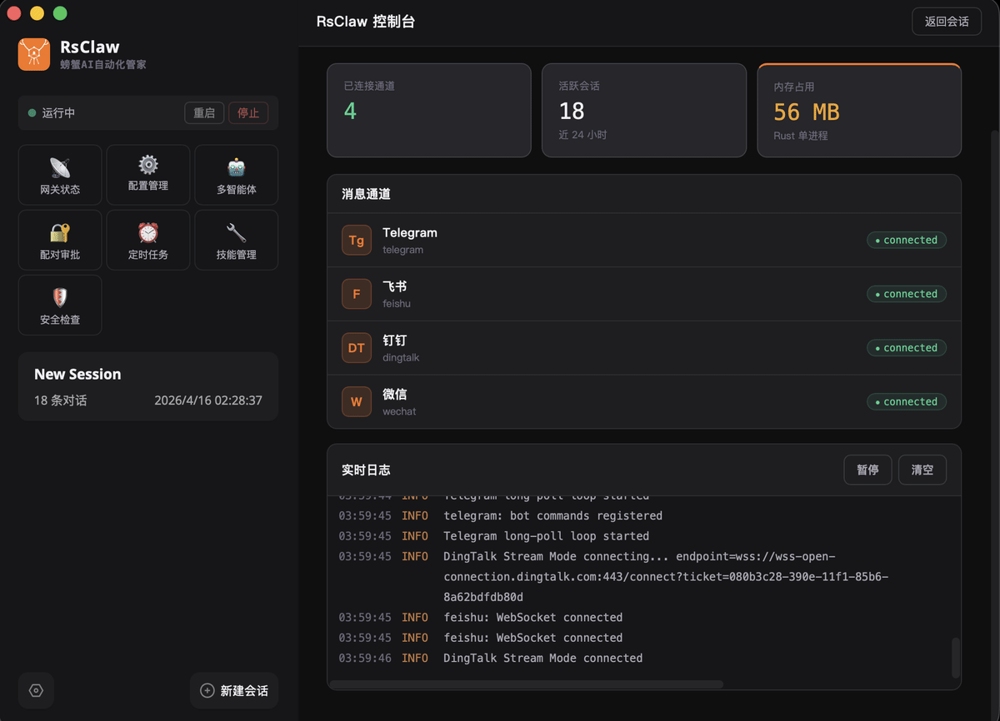

# RsClaw

**支持 OpenClaw 一键迁移的 AI 自动化管家，自带长期记忆，永不健忘。**

[](https://www.rust-lang.org/)
[](LICENSE)
[]()

**中文** | [English](../../README.md) | [日本語](README_ja.md) | [한국어](README_ko.md) | [ไทย](README_th.md) | [Tiếng Việt](README_vi.md) | [Français](README_fr.md) | [Deutsch](README_de.md) | [Español](README_es.md) | [Русский](README_ru.md)

螃蟹 AI（RsClaw）是基于 Rust 从零重构的 AI 自动化管家，拥有原生长期记忆与自我进化能力，全平台桌面版一键安装，开箱即用。支持 OpenClaw 一键迁移，原有配置无缝切换。

<p align="center">
  
</p>

💬 [加入用户交流群](https://rsclaw.ai/community) — 微信 / 飞书 / QQ / Telegram

---

## 从 OpenClaw 迁移

```bash
# 停止 OpenClaw
openclaw gateway stop

# 运行 RsClaw 设置（检测 OpenClaw 数据，提供导入选项）
rsclaw setup

# 启动 RsClaw（rsclaw gateway start 的简写）
rsclaw start
```

`rsclaw setup` 检测现有 OpenClaw 安装并提供两个选项：

- **导入**（推荐）-- 将配置、工作区和会话历史复制到 `~/.rsclaw/`。OpenClaw 数据只读，不会被修改。
- **全新开始** -- 忽略 OpenClaw 数据，从零开始。

配置解析优先级：

| 优先级 | 来源 |
|--------|------|
| 1（最高） | `--config-path <file>` CLI 参数 |
| 2 | `$RSCLAW_BASE_DIR/rsclaw.json5` |
| 3 | `~/.rsclaw/rsclaw.json5` |
| 4（最低） | `.rsclaw.json5`（当前目录） |

完全支持所有 OpenClaw 配置字段，未知字段静默忽略以保持前向兼容。

---

## RsClaw vs OpenClaw

| 特性 | RsClaw | OpenClaw |
|------|--------|----------|
| 语言 | Rust | TypeScript/Node.js |
| 二进制体积 | ~12MB | ~300MB+（node_modules） |
| 启动时间 | ~26ms | 2-5s |
| 内存占用 | ~20MB 空闲 | ~1000MB+ |
| 依赖数 | 542（Rust crates） | 1000+（npm） |
| 协议兼容 | OpenClaw WS v3（完整） | 原生 |
| OpenAI 兼容 | `/v1/chat/completions` + `/v1/models` | `/v1/chat/completions` |
| 消息通道 | 13 + 自定义 webhook | 8 |
| LLM 提供商 | 15 个预配置 | ~10 |
| 内置工具 | 32 | ~25 |
| 预解析命令 | 40+（零 token，<1ms） | -- |
| Shell 集成 | 完整 `sh -c`（管道、重定向） | -- |
| CDP 浏览器 | 内置 headless Chrome（20 个操作） | -- |
| 读写安全 | 阻止 .ssh、.env、凭证文件 | -- |
| 可定制默认配置 | 运行时 defaults.toml 覆盖 | -- |
| 执行安全规则 | deny/confirm/allow（40+ 模式） | -- |
| 写入沙箱 | 路径隔离 + 内容扫描 | -- |
| 文件上传门控 | 两层确认（体积 + token） | -- |
| 视觉模型检测 | 模型名自动匹配 | -- |
| 图片压缩 | 自动缩放至 1024px JPEG | -- |
| 办公文档提取 | DOCX/XLSX/PPTX（原生，无需外部工具） | -- |
| 每智能体权限 | 可配置命令 ACL | -- |
| 工具循环检测 | 滑动窗口（12 次/8 阈值） | -- |
| 上传运行时调参 | /set_upload_size, /set_upload_chars | -- |
| 技能仓库 | ClawHub + SkillHub（自动回退） | 仅 ClawHub |
| computer_use | 原生截图/鼠标/键盘控制 | 仅通过浏览器 |
| A2A 协议 | Google A2A v0.3（跨网络 agent 协作） | -- |
| 配置格式 | JSON5 | JSON5 |
| 热重载 | 通道变更自动重启 | 支持 |
| 自更新 | `rsclaw update` 从 GitHub 下载 | npm update |

---

## RsClaw 独有功能

### 预解析命令（40+）

本地命令，完全绕过 LLM -- 零 token 消耗，亚毫秒响应。

**Shell / 执行** -- 完整 shell 支持，管道、重定向、链式命令：

| 命令 | 说明 |
|------|------|
| `/run <cmd>` | 通过 `sh -c` 执行任意 shell 命令（支持管道：`ls \| grep rs`） |
| `/sh <cmd>` / `/exec <cmd>` | /run 的别名 |
| `$ <cmd>` | Shell 快捷方式（同 /run） |
| `! <cmd>` | Shell 快捷方式（同 /run） |
| `/ls [args]` | 列出文件（和原生 `ls` 行为一致，如 `/ls -la src/`） |
| `/cat <file>` | 读取文件内容 |
| `/read <file>` | 读取文件内容（/cat 别名） |
| `/write <path> <content>` | 写入文件 |
| `/find <pattern>` | 按名称查找文件 (`find . -name <pattern>`) |
| `/grep <pattern>` | 搜索文件内容 (`grep -rn <pattern>`) |

**网页搜索：**

| 命令 | 说明 |
|------|------|
| `/search <query>` | 网页搜索（DuckDuckGo/Google/Bing） |
| `/google <query>` | 网页搜索（别名） |
| `/fetch <url>` | 获取并提取网页内容 |
| `/screenshot <url>` | 网页截图 |
| `/ss` | 桌面截图 |

**系统与会话：**

| 命令 | 说明 |
|------|------|
| `/help` | 显示所有可用命令 |
| `/version` | 显示版本号（日期 + git hash） |
| `/status` | 网关状态 |
| `/health` | 健康检查 |
| `/uptime` | 显示运行时间 |
| `/models` | 列出可用模型 |
| `/model <name>` | 切换主模型 |
| `/clear` | 清除当前会话 |
| `/reset` | 重置会话 |
| `/history [n]` | 显示最近 N 条消息（默认 20） |
| `/sessions` | 列出所有会话 |
| `/cron list` | 列出定时任务 |
| `/send <to> <msg>` | 发送消息到指定通道/用户 |

**上下文与侧查询：**

| 命令 | 说明 |
|------|------|
| `/ctx <text>` | 添加持久背景上下文到当前会话 |
| `/ctx --ttl <N> <text>` | 添加上下文（N 轮后过期） |
| `/ctx --global <text>` | 添加全局上下文（所有会话） |
| `/ctx --list` | 列出活跃上下文 |
| `/ctx --remove <id>` | 按 ID 移除上下文 |
| `/ctx --clear` | 清除当前会话所有上下文 |
| `/btw <问题>` | 侧通道快速查询（跳过智能体队列，直接 LLM 调用） |

**记忆：**

| 命令 | 说明 |
|------|------|
| `/remember <text>` | 保存到长期记忆 |
| `/recall <query>` | 搜索记忆 |

**上传限制：**

| 命令 | 说明 |
|------|------|
| `/get_upload_size` | 查看当前文件大小限制 |
| `/set_upload_size <MB>` | 设置文件大小限制（运行时，重启恢复） |
| `/get_upload_chars` | 查看当前文本字符限制 |
| `/set_upload_chars <n>` | 设置文本字符限制（运行时，重启恢复） |
| `/config_upload_size <MB>` | 设置文件大小限制（写入配置文件，永久生效） |
| `/config_upload_chars <n>` | 设置文本字符限制（写入配置文件，永久生效） |

**技能：**

| 命令 | 说明 |
|------|------|
| `/skill install <name>` | 从仓库安装技能 |
| `/skill list` | 列出已安装技能 |
| `/skill search <query>` | 搜索技能仓库 |

### 执行安全规则

可配置的 deny/confirm/allow 模式，保护系统安全。内置 50+ 拒绝模式：

- **拒绝**：`sudo`、`rm -rf /`、`dd`、`mkfs`、`shutdown`、`curl|sh`、读写 `.ssh/`、`.env`、`openclaw.json`、`rsclaw.json5` 等
- **确认**：`rm -rf`、`git push --force`、`git reset --hard`、`docker rm`、`drop database` 等
- **允许**：白名单覆盖拒绝规则

读取保护阻止访问：SSH 密钥、GPG 密钥、云凭证（`.aws/`、`.kube/`、`.gcloud/`）、AI 工具配置（`.claude/`、`.opencode/`、`openclaw.json`、`rsclaw.json5`）、Shell 历史、数据库密码和系统认证文件。

在配置中设置 `tools.exec.safety = true` 启用。

### 两层文件上传确认

防止大文件意外消耗大量 token：

- **第一层（体积门）**：文件 > 50MB 触发确认，可选：分析 / 保存到工作区 / 丢弃
- **第二层（Token 门）**：提取文本 > 50,000 字符触发 token 消耗确认

限制可通过 `/set_upload_size` 和 `/set_upload_chars` 运行时调整。

### 视觉模型自动检测

自动检测当前模型是否支持图片（GPT-4V、Claude 3、Gemini、Qwen-VL 等）。非视觉模型接收 `[image]` 文本占位符而非 base64 数据，避免无声的 token 浪费。

### 原生语音识别（STT）

多提供商语音转文字，自动回退链：

1. **Candle Whisper** -- 本地模型，零 API 成本
2. **whisper.cpp** -- 本地二进制，CPU 快速推理
3. **macOS SFSpeechRecognizer** -- 离线，系统级
4. **腾讯云 ASR** / **阿里云 ASR** -- 云服务
5. **OpenAI Whisper API** -- 兜底

支持微信 SILK v3、Opus、MP3、WAV、OGG、M4A、AAC、FLAC，纯 Rust symphonia 解码器 + ffmpeg 回退。繁简中文自动转换。

### 视频与音频处理

视频文件（.mp4、.mov、.avi、.mkv、.webm）自动处理：ffmpeg 提取音轨，然后转写为文本。音频文件直接转写。结果作为 `[Audio transcription from {ext} file]` 上下文注入。

### 文档提取

原生文本提取，无需外部工具：

| 格式 | 方式 |
|------|------|
| **PDF** | `pdf_extract` crate（纯 Rust），`pdftotext` 回退 |
| **DOCX** | ZIP → `word/document.xml` 解析 |
| **XLSX** | ZIP → `xl/sharedStrings.xml` 解析 |
| **PPTX** | ZIP → `ppt/slides/slide*.xml` 解析 |
| **文本/代码** | 直接读取（100+ 扩展名自动识别） |

### 图片压缩

图片自动缩放到最大 1024px 并转换为 JPEG，减少 token 消耗。

### 写入沙箱

工作区路径隔离和内容扫描。阻止写入敏感系统路径，扫描脚本内容中的危险模式。

### 每智能体命令权限

主智能体获得 `*`（所有命令）。其他智能体按配置限制，防止未授权的工具访问。

### 工具循环检测

滑动窗口检测器（12 次调用窗口，8 次阈值）防止无限工具调用循环。在生产性操作后自动重置。

### 配置分区菜单

交互式 `rsclaw configure` 包含 7 个分区：

1. 网关（端口、绑定地址）
2. 模型提供商（提供商、API 密钥、模型）
3. 消息通道（逐个添加/移除/配置）
4. 网页搜索（提供商、API 密钥）
5. 上传限制（文件大小、文本字符数、视觉模型开关）
6. 执行安全（开/关）

支持 `--section` 参数直达：`rsclaw configure --section channels`。

### CDP 浏览器自动化

内置 headless Chrome 控制，通过 Chrome DevTools Protocol -- 无需 ChromeDriver、Playwright 或 Node.js：

- **20 个操作**：open, snapshot, click, fill, type, select, check/uncheck, scroll, screenshot, pdf, back, forward, reload, get_text, get_url, get_title, wait, evaluate, cookies
- **无障碍树快照** 带 `@e1`、`@e2` 元素引用，LLM 友好的交互方式
- **内存自适应**：根据系统内存自动限制 Chrome 实例数（每 2GB 一个，最低 200MB 空闲）
- **自动生命周期**：5 分钟空闲超时、崩溃检测 + 自动重启、进程退出清理

### 可定制默认配置（`defaults.toml`）

将 `defaults.toml` 放在 `$base_dir/` 即可在运行时覆盖内置默认值，无需重新编译：

- Provider 定义（添加/移除 LLM 提供商）
- Channel 字段定义（自定义 onboard/configure 向导）
- 执行安全规则（deny/confirm/allow 模式）
- 搜索引擎 URL
- 技能仓库 URL

`rsclaw setup` 会写入一份供编辑的副本。外部文件优先，内置版本为兜底。

### 其他独有特性

- **双技能仓库** -- ClawHub + SkillHub（腾讯 COS）自动回退
- **computer_use 工具** -- 原生桌面截图、鼠标和键盘控制
- **ACP 扩展命令** -- spawn/connect/run/send/list/kill（OpenClaw 仅有 `client`）
- **配对撤销** -- OpenClaw 仅有 approve + list
- **`--base-dir` / `--config-path` 全局参数** -- 灵活的配置路径覆盖
- **日期版本号** -- 构建时自动生成 `YYYY.M.D (git-hash)`

---

## 快速安装

### 预编译二进制（推荐）

```bash
# macOS / Linux（自动检测平台）
curl -fsSL https://app.rsclaw.ai/scripts/install.sh | bash
```

```powershell
# Windows（PowerShell）
irm https://app.rsclaw.ai/scripts/install.ps1 | iex
```

支持平台：macOS (x86_64, ARM64)、Linux (x86_64, ARM64)、Windows (x86_64, ARM64)。

### 桌面客户端

从 [Releases](https://github.com/rsclaw-ai/rsclaw/releases) 下载：`.dmg` (macOS)、`.msi` (Windows)、`.deb` (Linux)。

**macOS 安全提示：** 应用尚未签名，安装后需要执行：

```bash
# 1. 允许任何来源的应用（系统设置 > 隐私与安全性）
sudo spctl --master-disable

# 2. 移除隔离属性
sudo xattr -rd com.apple.quarantine /Applications/RsClaw.app
```

### 从源码编译

```bash
git clone https://github.com/rsclaw-ai/rsclaw.git
cd rsclaw
cargo build --release
# 二进制文件位于 ./target/release/rsclaw（~12MB）
```

### 本地交叉编译

```bash
# 从 macOS/Linux 主机构建全平台
./scripts/build.sh all

# 或按平台组构建
./scripts/build.sh macos    # macOS x86_64 + ARM64
./scripts/build.sh linux    # Linux x86_64 + ARM64（musl 静态链接）
./scripts/build.sh windows  # Windows x86_64（MSVC，通过 cargo-xwin）
```

### 首次运行

```bash
# 首次设置（检测 OpenClaw 数据并提供导入）
rsclaw setup

# 启动网关
rsclaw start
```

---

## 快速开始

```bash
# 交互式设置向导
rsclaw onboard

# 启动网关
rsclaw start

# 查看状态
rsclaw status

# 健康检查
rsclaw doctor --fix

# 配置（分区菜单）
rsclaw configure

# 配置特定分区
rsclaw configure --section channels
```

---

## 更新 / 升级

```bash
# 从 GitHub 自动更新
rsclaw update

# 或从源码手动更新
cd /path/to/rsclaw
git pull origin main
cargo build --release

# 查看当前版本
rsclaw --version
```

`rsclaw update` 从 [github.com/rsclaw-ai/rsclaw](https://github.com/rsclaw-ai/rsclaw) 下载最新发布版二进制文件并原地替换。如果以服务方式运行，网关会在更新后自动重启。

---

## 支持的消息通道（13 + 自定义）

| # | 通道 | 协议 | 配置方式 |
|---|------|------|----------|
| 1 | **微信（个人号）** | ilink 长轮询 | 扫码登录 `rsclaw channels login wechat`。语音 STT、图片/文件/视频、SILK 解码。 |
| 2 | **飞书 / Lark** | WebSocket | OAuth 扫码或手动填写 `appId` + `appSecret`。事件去重、富文本。 |
| 3 | **企业微信** | AI Bot WebSocket | `botId` + `secret`（企业微信后台）。自动重连、Markdown 回复。 |
| 4 | **QQ 机器人** | WebSocket Gateway | `appId` + `appSecret`。群/C2C/频道、沙箱模式。 |
| 5 | **钉钉** | Stream Mode WebSocket | `appKey` + `appSecret`。私聊 + 群聊、语音转写。 |
| 6 | **Telegram** | HTTP 长轮询 | `botToken`。私聊 + 群聊（@提及）、语音/图片/文件/视频。 |
| 7 | **Matrix** | HTTP /sync 长轮询 | `homeserver` + `accessToken` + `userId`。可选 E2EE（`--features channel-matrix`）。 |
| 8 | **Discord** | Gateway WebSocket | Bot token。Guild/DM、反应通知、流式编辑。 |
| 9 | **Slack** | Socket Mode WebSocket | `botToken` + `appToken`。无需公网 URL。 |
| 10 | **WhatsApp** | Webhook (Cloud API) | `WHATSAPP_PHONE_NUMBER_ID` + `WHATSAPP_ACCESS_TOKEN` 环境变量。Meta webhook 验证。 |
| 11 | **Signal** | signal-cli JSON-RPC | 手机号 + signal-cli 二进制。端到端加密。 |
| 12 | **LINE** | Webhook | `channelAccessToken` + `channelSecret`。推送/回复 API。 |
| 13 | **Zalo** | Webhook | `accessToken` + `oaSecret`。官方账号 API。 |
| -- | **自定义 Webhook** | Webhook POST | 发送 JSON 到 `/hooks/{name}`。通用入站处理器，支持任意平台。 |

通道特性：DM/群组策略（open/pairing/allowlist/disabled）、健康监控、代码块保护的文本分块、指数退避消息重试、配对码（8 字符 XXXX-XXXX，1 小时有效期）、流式模式（off/partial/block/progress）、文件上传两层确认。

---

## LLM 提供商（15 个预配置）

| 提供商 | 基础 URL | 备注 |
|--------|----------|------|
| **通义千问**（阿里 DashScope） | dashscope.aliyuncs.com | qwen-turbo, qwen-plus, qwen-max |
| **DeepSeek** | api.deepseek.com | 流式工具调用累积 |
| **Kimi**（月之暗面） | api.moonshot.cn | |
| **智谱**（GLM） | open.bigmodel.cn | |
| **MiniMax** | api.minimax.chat | |
| **GateRouter** | api.gaterouter.com | 多模型路由 |
| **OpenRouter** | openrouter.ai/api | |
| **Anthropic** | api.anthropic.com | Claude 3/4 系列 |
| **OpenAI** | api.openai.com | GPT-4o, o1, o3 |
| **Google Gemini** | generativelanguage.googleapis.com | |
| **xAI**（Grok） | api.x.ai | |
| **Groq** | api.groq.com | Llama, Mixtral |
| **硅基流动** | api.siliconflow.cn | |
| **Ollama** | localhost:11434 | 本地模型 |
| **自定义** | 用户定义 | 任何 OpenAI 兼容 API |

提供商特性：指数退避故障转移、模型回退链、图片回退模型、思维预算分配、token 用量追踪、从配置/环境变量/auth-profiles 自动注册。

---

## 内置工具（32 个）

| 分类 | 工具 |
|------|------|
| **文件** | `read`、`write` |
| **Shell** | `exec`（带安全规则） |
| **记忆** | `memory_search`、`memory_get`、`memory_put`、`memory_delete` |
| **网页** | `web_search`、`web_fetch`、`web_browser`、`computer_use` |
| **媒体** | `image`、`pdf`、`tts` |
| **消息** | `message`、`telegram_actions`、`discord_actions`、`slack_actions`、`whatsapp_actions`、`feishu_actions`、`weixin_actions`、`qq_actions`、`dingtalk_actions` |
| **会话** | `sessions_send`、`sessions_list`、`sessions_history`、`session_status` |
| **系统** | `cron`、`gateway`、`subagents`、`agent_spawn`、`agent_list` |

网页搜索引擎：DuckDuckGo（默认）、Brave、Google、Bing -- 通过 `rsclaw configure --section web_search` 配置。

---

## 存储架构

| 层级 | 引擎 | 用途 |
|------|------|------|
| **热 KV** | redb 2 | 会话、消息、配对状态、配置缓存 |
| **全文搜索** | tantivy 0.22 | 记忆搜索、文档索引 |
| **向量搜索** | hnsw_rs 0.3 | 语义相似度、自动召回 |

数据存储在 `$base_dir/var/` -- `var/data/`（redb/search/memory）、`var/run/`、`var/logs/`、`var/cache/`。

---

## 配置

示例 `rsclaw.json5`：

```json5
{
  gateway: {
    port: 18888,
    bind: "loopback",
  },
  models: {
    providers: {
      qwen: {
        apiKey: "${DASHSCOPE_API_KEY}",
        baseUrl: "https://dashscope.aliyuncs.com/compatible-mode/v1",
      },
    },
  },
  agents: {
    defaults: {
      model: { primary: "qwen/qwen-turbo" },
      thinking: { level: "medium" },
    },
  },
  channels: {
    telegram: { botToken: "${TELEGRAM_BOT_TOKEN}" },
    feishu: { appId: "xxx", appSecret: "xxx" },
  },
  tools: {
    exec: { safety: true },
    upload: { max_file_size: 50000000, max_text_chars: 50000 },
  },
}
```

### 提供商自动注册

LLM 提供商从以下来源自动注册：
1. 配置文件 `models.providers` 段
2. 环境变量（`OPENAI_API_KEY`、`ANTHROPIC_API_KEY` 等）

### 多智能体配置

```json5
{
  agents: {
    defaults: {
      model: { primary: "qwen/qwen-turbo" },
      thinking: { level: "medium" },
    },
    list: [
      {
        id: "main",
        default: true,
        model: { primary: "anthropic/claude-sonnet-4-5" },
        allowed_commands: "*",
      },
      {
        id: "coder",
        model: { primary: "anthropic/claude-sonnet-4-5" },
        workspace: "~/projects",
        allowed_commands: "read|write|exec",
        temperature: 0.2,
      },
      {
        id: "researcher",
        model: { primary: "openai/gpt-4o" },
        allowed_commands: "web_search|web_fetch|memory_search",
      },
    ],
    // 远程智能体（A2A 协议）
    external: [
      {
        id: "remote-agent",
        url: "https://remote-gateway.example.com",
        auth_token: "${REMOTE_AGENT_TOKEN}",
      },
    ],
  },
}
```

协作模式：**顺序执行**（链式）、**并行执行**（扇出）、**编排执行**（LLM 通过 `agent_<id>` 工具调用驱动）。

### 多通道配置

```json5
{
  channels: {
    telegram: {
      botToken: "${TELEGRAM_BOT_TOKEN}",  // ${VAR} 环境变量替换
      dmPolicy: "pairing",               // 新用户需输入配对码
      groupPolicy: "open",
    },
    feishu: {
      appId: "cli_xxxx",
      appSecret: "${FEISHU_APP_SECRET}",
      dmPolicy: "pairing",
    },
    wechat: {
      // 通过 `rsclaw channels login wechat` 扫码登录
      dmPolicy: "pairing",
    },
    discord: {
      token: "${DISCORD_BOT_TOKEN}",
      dmPolicy: "pairing",
      groupPolicy: "allowlist",
      groupAllowFrom: ["server-id-1"],
    },
    // 自定义 Webhook 集成
    custom: [
      {
        id: "my-webhook",
        type: "webhook",
        replyUrl: "https://your-app.example.com/callback",
        textPath: "$.message.text",
        senderPath: "$.message.from",
      },
    ],
  },
}
```

每个通道支持独立的 DM/群组策略、配对码、健康监控和智能体路由。所有字符串值支持 `${VAR}` 环境变量替换。

### DM 配对

`dmPolicy` 设为 `"pairing"` 时，新用户必须输入 8 位配对码（格式 XXXX-XXXX，1 小时有效）才能开始聊天：

```bash
# 生成配对码
rsclaw pairing pair

# 列出活跃配对
rsclaw pairing list

# 撤销配对
rsclaw pairing revoke <device-id>
```

用户将配对码作为第一条消息发送。配对成功后设备被记住，无需再次配对。

### 多实例

```bash
rsclaw --dev gateway run          # 使用 ~/.rsclaw-dev
rsclaw --profile test gateway run # 使用 ~/.rsclaw-test
```

---

## 集成

### MCP（模型上下文协议）

启动 MCP 服务器子进程，JSON-RPC 工具发现。工具自动注册为 `mcp_<server>_<tool>`。在 `mcp` 配置段中设置。

### 插件

基于 Hook 的插件架构，生命周期事件：`pre_turn`、`post_turn`、`pre_tool_call`、`post_tool_call`、`on_error`。插件从 `plugins/` 目录加载。

### 技能

从 ClawHub 和 SkillHub 仓库获取外部技能包。通过 `rsclaw skills install <name>` 或 `/skill install <name>` 安装。

### A2A 协议（Agent-to-Agent）

rsclaw 实现了 [Google A2A Protocol v0.3](https://a2a-protocol.org/latest/specification/)，支持跨网络的 agent 间通信。这是 rsclaw 的独有功能，OpenClaw 不支持此协议。

**核心能力：**

- **Agent Card 自动发现** -- 符合规范的 `/.well-known/agent.json` 端点，远程 agent 可自动发现本网关的能力和技能列表
- **JSON-RPC 2.0 任务分发** -- 通过标准 `tasks/send` 方法向指定 agent 发送任务，支持会话保持和超时控制
- **跨机器 agent 协作** -- 本地 agent 和远程 agent 通过 A2A 协议无缝协作，Bearer token 认证
- **三种协作模式** -- 顺序执行（链式）、并行执行（扇出）、编排执行（LLM 驱动的 `agent_<id>` 工具调用）
- **流式支持** -- Agent Card 声明 streaming 能力，支持流式任务响应

**端点：**

| 端点 | 方法 | 说明 |
|------|------|------|
| `/.well-known/agent.json` | GET | Agent Card 发现，返回网关所有 agent 的能力描述 |
| `/api/v1/a2a` | POST | JSON-RPC 2.0 任务端点，接收 `tasks/send` 请求 |

**配置示例 -- 启用跨网络 A2A：**

```json5
{
  gateway: {
    bind: "all",   // 跨网络 A2A 必须绑定到所有接口
    port: 18888,
  },
  agents: {
    list: [
      {
        id: "researcher",
        default: true,
        model: { primary: "anthropic/claude-sonnet-4-20250514" },
      },
      {
        id: "coder",
        model: { primary: "anthropic/claude-sonnet-4-20250514" },
      },
    ],
    // 连接远程 A2A 网关上的智能体
    external: [
      {
        id: "remote-analyst",
        url: "https://remote-gateway.example.com",
        auth_token: "${REMOTE_AGENT_TOKEN}",
      },
    ],
  },
}
```

**Agent Card 示例（GET `http://host:18888/.well-known/agent.json`）：**

```json
{
  "protocolVersion": "0.3",
  "name": "rsclaw",
  "description": "OpenClaw-compatible multi-agent AI gateway",
  "url": "http://host:18888/api/v1/a2a",
  "capabilities": { "streaming": true, "pushNotifications": false },
  "defaultInputModes": ["text/plain"],
  "defaultOutputModes": ["text/plain"],
  "skills": [
    { "id": "researcher", "name": "researcher", "inputModes": ["text/plain"], "outputModes": ["text/plain"] },
    { "id": "coder", "name": "coder", "inputModes": ["text/plain"], "outputModes": ["text/plain"] }
  ]
}
```

**发送 A2A 任务（POST `http://host:18888/api/v1/a2a`）：**

```json
{
  "jsonrpc": "2.0",
  "id": "task-001",
  "method": "tasks/send",
  "params": {
    "id": "task-001",
    "message": {
      "role": "user",
      "parts": [{ "type": "text", "text": "Analyze the performance of module X" }]
    },
    "metadata": { "agentId": "researcher" }
  }
}
```

**协作模式详解：**

| 模式 | 说明 | 适用场景 |
|------|------|----------|
| **顺序执行**（Sequential） | agent 按顺序运行，前一个的输出作为后一个的输入 | 流水线式处理：研究 -> 编码 -> 审查 |
| **并行执行**（Parallel） | 所有 agent 同时运行相同输入，结果汇总 | 多角度分析、多语言翻译 |
| **编排执行**（Orchestrated） | 主 LLM 通过 `agent_<id>` 工具调用决定调度哪个 agent | 复杂任务分解，LLM 自主编排子任务 |

编排模式下，主 agent 的 LLM 可调用 `agent_researcher`、`agent_coder` 等工具，每个工具接受 `{"message": "子任务描述"}` 参数，返回子 agent 的文本回复。子 agent 使用独立的子会话（`{session}:a2a:{agent_id}`），不污染主会话上下文。

### 定时任务

使用 cron 表达式定期调度智能体运行。通过 `rsclaw cron` 或 `/cron list` 管理。

### Webhooks

Webhook 入口 `/hooks/:path`，支持动作分发（调用智能体、触发定时任务等）。

---

## 路线图

### 第一阶段 -- CLI 补齐 + 稳定

- 现有命令：补充 --json/--verbose/--timeout 通用选项
- 新命令：completion、dashboard、daemon、qr、docs、uninstall
- 中型命令：agent（单数）、devices、directory、approvals
- Gateway/doctor/logs/sessions/status 选项补齐
- Control UI：剩余 5 个 WS API 方法 + 配置 Schema 页面

### 第二阶段 -- 大型命令 + 生态

- message 命令树（25+ 子命令）
- node/nodes 分布式计算命令
- onboard 70+ 非交互参数
- 插件市场 + uninstall/update/inspect

### 第三阶段 -- 高级功能

- browser 命令（35+ CDP 子命令）
- `--container` 全局选项（Podman/Docker）
- 非 Gemini 模型的视频帧提取
- 企业微信/Signal 多媒体发送补全

### 第四阶段 -- 公开发布

- 100% CLI 兼容（browser 除外）
- 100% Control UI 兼容
- Homebrew / cargo install 分发
- 完整文档站点

---

## 常见问题

**RsClaw 和 OpenClaw 可以同时运行吗？**
可以。RsClaw 默认使用端口 18888，OpenClaw 默认使用 18789。它们使用独立的数据目录（`~/.rsclaw/` vs `~/.openclaw/`），可以并行运行。

**RsClaw 会修改我的 OpenClaw 数据吗？**
不会。导入模式读取 OpenClaw 文件（配置、工作区、会话）但不会写入 `~/.openclaw/`。所有 RsClaw 数据存储在 `~/.rsclaw/`。

**如何切换回 OpenClaw？**
`rsclaw stop && openclaw gateway start`。你的 `~/.openclaw/` 目录未被修改。

**支持所有 OpenClaw WebSocket 方法吗？**
已实现 33+ 方法，包括聊天流式输出。RsClaw 与 OpenClaw WebUI（控制面板）在 `http://localhost:18789` 完全线路兼容。

**Node.js 技能/插件怎么办？**
RsClaw 可以从 ClawHub 和 SkillHub 安装和运行技能。JS 技能仍需要 Node.js 运行时。

**如何启用执行安全？**
在配置中设置 `tools.exec.safety = true`，或使用 `rsclaw configure --section exec_safety`。内置 40+ 拒绝模式，可在 `defaults.toml` 中自定义。

**如何更新 RsClaw？**
运行 `rsclaw update` 从 GitHub 下载最新发布版。源码构建用 `git pull && cargo build --release`。

**RsClaw 数据存储在哪里？**
在 `~/.rsclaw/`。导入模式在 setup 时将 OpenClaw 数据复制到此处。RsClaw 和 OpenClaw 目录完全独立。

**如何配置文件上传限制？**
使用 `rsclaw configure --section upload_limits` 或在配置中设置 `tools.upload.max_file_size` / `tools.upload.max_text_chars`。运行时可通过 `/set_upload_size` 和 `/set_upload_chars` 调整。

---

## 开发

```bash
# 运行测试
cargo test

# 带调试日志运行
RUST_LOG=rsclaw=debug cargo run -- gateway run

# 构建发布版
cargo build --release
```

### 架构

```
src/
  agent/       # 智能体运行时、记忆、工具分发、循环检测、预解析
  channel/     # 13 个通道：Telegram、微信、飞书、钉钉等
  config/      # JSON5 加载器、Schema、6 级配置优先级
  gateway/     # 启动、热重载、通道接线
  mcp/         # MCP 客户端（stdin/stdout JSON-RPC）
  plugin/      # 插件 Shell 桥接、Hook 注册
  provider/    # LLM 提供商：Anthropic、OpenAI、Gemini、故障转移
  server/      # Axum HTTP 服务器、REST API、OpenAI 兼容端点
  skill/       # 技能加载器、ClawHub/SkillHub 客户端、工具运行器
  store/       # redb KV + tantivy BM25 + hnsw_rs 向量
  ws/          # WebSocket 协议 v3
  cmd/         # CLI 命令：setup、configure、security 等
  acp/         # ACP 协议（智能体 spawn/connect/run）
  a2a/         # Google A2A v0.3 协议（server + client，跨网络 agent 协作）
```

### Matrix E2EE

使用 `cargo build --release --features channel-matrix` 构建以支持加密房间。需要在配置中设置恢复密钥（`channels.matrix` 下的 `recoveryKey` 字段）。不带此 feature flag 时，Matrix 使用轻量 reqwest 驱动（仅支持未加密房间）。

### 环境要求

- Rust 1.91+（Edition 2024）
- macOS / Linux / Windows
- 可选：ffmpeg（图片压缩、语音转写）
- 可选：whisper-cpp（本地语音转文字）
- 可选：`--features channel-matrix`（Matrix E2EE，引入 matrix-sdk）

### 交叉编译前置依赖（macOS 主机）

```bash
brew install filosottile/musl-cross/musl-cross   # Linux musl 目标
cargo install cargo-xwin                          # Windows MSVC 目标
rustup target add x86_64-unknown-linux-musl aarch64-unknown-linux-musl \
                  x86_64-pc-windows-msvc aarch64-pc-windows-msvc \
                  x86_64-apple-darwin
```

---

## 许可证

本项目使用 [GNU Affero General Public License v3.0 (AGPL-3.0)](LICENSE) 许可。

这意味着你可以自由使用、修改和分发本软件，但任何修改版本（包括通过网络提供服务）都必须以相同许可证开源。
