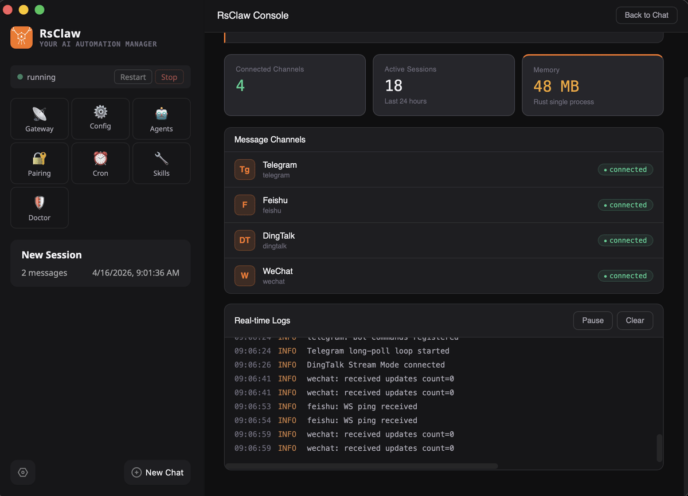

# RsClaw

**AI Automation Manager with One-Click OpenClaw Migration & Native Long-Term Memory.**

[](https://www.rust-lang.org/)
[](LICENSE)
[]()

[English](../../README.md) | [中文](README_cn.md) | [日本語](README_ja.md) | [한국어](README_ko.md) | [ไทย](README_th.md) | [Tiếng Việt](README_vi.md) | [Français](README_fr.md) | **Deutsch** | [Español](README_es.md) | [Русский](README_ru.md)

RsClaw ist eine komplette Neuentwicklung von [OpenClaw](https://github.com/openclaw/openclaw) in Rust. Es bietet dasselbe Multi-Agenten-KI-Gateway-Protokoll mit 10x schnellerem Start, 10x kleinerem Footprint und ohne Node.js-Abhaengigkeit.


<p align="center">
  
</p>

💬 [Join Community](https://rsclaw.ai/en/community) — WeChat / Feishu / QQ / Telegram

---

## Hauptmerkmale

- **13+ Nachrichtenkanaele** -- Telegram, Discord, Slack, WeChat, Feishu, DingTalk, QQ, WhatsApp, LINE, Signal, Matrix, Zalo, benutzerdefinierter Webhook
- **15 LLM-Anbieter** -- OpenAI, Anthropic, Google Gemini, DeepSeek, Qwen, Ollama usw.
- **32 integrierte Werkzeuge** -- Dateien, Shell, Websuche/Browser, Bildgenerierung, Speicher, Messaging, Cron, A2A
- **40+ PreParse-Befehle** -- Umgehen LLM, null Token, Sub-Millisekunden-Antwort
- **CDP-Browser-Automatisierung** -- Integrierte headless Chrome-Steuerung (20 Aktionen)
- **A2A-Protokoll** -- Google A2A v0.3 (netzwerkuebergreifende Agenten-Zusammenarbeit)
- **Ausfuehrungssicherheit** -- deny/confirm/allow-Regeln, 50+ Ablehnungsmuster

## Schnellinstallation

```bash
# macOS / Linux (automatische Plattformerkennung)
curl -fsSL https://app.rsclaw.ai/scripts/install.sh | bash
```

```powershell
# Windows (PowerShell)
irm https://app.rsclaw.ai/scripts/install.ps1 | iex
```

### Aus Quellcode kompilieren

```bash
git clone https://github.com/rsclaw-ai/rsclaw.git
cd rsclaw
cargo build --release
```

## Schnellstart

```bash
rsclaw onboard    # Einrichtungsassistent
rsclaw start      # Gateway starten
rsclaw status     # Status pruefen
rsclaw doctor --fix  # Gesundheitscheck
```

## Unterstuetzte Plattformen

macOS (x86_64, ARM64), Linux (x86_64, ARM64), Windows (x86_64, ARM64)

## Dokumentation

Vollstaendige Dokumentation in [README.md](../../README.md) (中文) oder [README_en.md](../../README.md) (English).

## Lizenz

Dieses Projekt ist unter der [GNU Affero General Public License v3.0 (AGPL-3.0)](LICENSE) lizenziert.

Sie koennen diese Software frei verwenden, aendern und verteilen, aber jede geaenderte Version (einschliesslich Netzwerkdienste) muss unter derselben Lizenz als Open Source veroeffentlicht werden.
