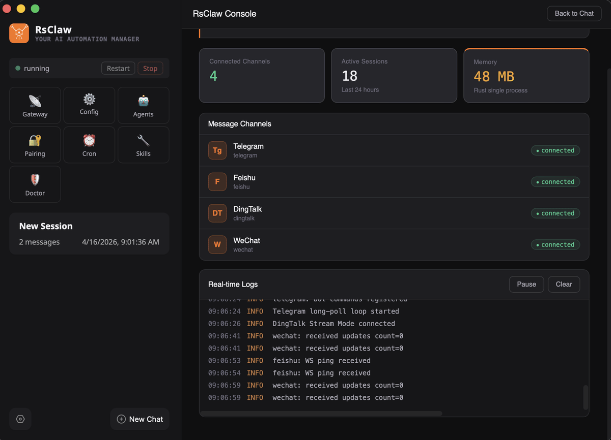

# RsClaw

> **เอ็นจิน AI agent ที่จดจำ เรียนรู้ และเราต์ข้ามเครื่อง.**
> Rust binary ขนาด 21MB · A2A hub-spoke fleet · ความจำสามชั้น · Knowledge base vector + BM25 · 13 channels · 15 LLM providers · OpenClaw drop-in replacement.

[](https://github.com/rsclaw-ai/rsclaw/stargazers)
[](https://crates.io/crates/rsclaw)
[](../../README.md#license)
[](https://www.rust-lang.org/)

[🇺🇸 English](../../README.md) · [🇨🇳 中文](README_cn.md) · [🇯🇵 日本語](README_ja.md) · [🇰🇷 한국어](README_ko.md) · **ไทย** · [Tiếng Việt](README_vi.md) · [Français](README_fr.md) · [Deutsch](README_de.md) · [Español](README_es.md) · [Русский](README_ru.md)

<p align="center">
  
</p>

AI agent ส่วนใหญ่เป็น stateless process ที่ถูกผูกติดกับ chat box. **RsClaw คือ fleet**: แต่ละ node เก็บ memory แบบ structured, index private knowledge base และพูด [Google A2A v1.0](https://a2a-protocol.org/). คำขอที่พิมพ์บน laptop ของคุณสามารถ fan out ไปยัง GPU spoke สำหรับสร้างภาพ, fleet node สำหรับ RAG และ remote partner agent สำหรับ specialist task — ทั้งหมดส่งกลับมาเป็น streamed answer หนึ่งเดียว.

21 MB, ~28 MB RAM, single binary. Rust ล้วนๆ. ไม่มี Node, ไม่มี Python.

💬 [เข้าร่วมคอมมูนิตี้](https://rsclaw.ai/en/community) — WeChat / Feishu / QQ / Telegram

---

## ติดตั้ง

```bash
# Homebrew (macOS / Linux) — แนะนำ
brew tap rsclaw-ai/tap
brew install rsclaw            # CLI
brew install --cask rsclaw     # Desktop app (macOS DMG)

# Cargo
cargo install rsclaw

# One-liner (macOS / Linux)
curl -fsSL https://app.rsclaw.ai/scripts/install.sh | bash

# Windows
irm https://app.rsclaw.ai/scripts/install.ps1 | iex
```

```bash
rsclaw setup          # initialize ~/.rsclaw/
rsclaw onboard        # interactive wizard: provider, channel, embedder
rsclaw start
```

---

## A2A — Agent-to-agent routing ระดับ fleet

RsClaw implement [Google A2A v1.0 spec](https://a2a-protocol.org/latest/specification/) แบบเต็ม — streaming, push notifications, task persistence, cancel, INPUT_REQUIRED interrupts, ครบทั้ง 11 JSON-RPC methods — บวกกับ **first-class hub-spoke relay** ที่หลอมรวม fleet ของเครื่องต่างชนิดเป็น logical agent เดียว. แต่ละ spoke เก็บ persistent outbound WebSocket connection ไปยัง hub — ไม่ต้องเปิด inbound port ที่ spoke. ทำงานหลัง NAT, firewall และสภาพ network จีนแผ่นดินใหญ่.

→ Protocol surface ครบ, การ operate hub-spoke, identity & ACL, tunnel recipes: [docs/a2a.md](../a2a.md).

---

## Memory — สามชั้น, รับรู้การเสื่อม, hybrid recall

Long-term memory ที่ไม่ต้องจัดการเอง. ทุก turn ที่เกี่ยวข้อง runtime จะ extract สัญญาณที่ใช้ได้ระยะยาวเป็น structured docs (entity / preference / fact / procedure / relationship / lesson / failure), จัด tier เป็น **Core / Working / Peripheral** ด้วย **Weibull stretched-exponential decay** ต่อ tier, และ recall ผ่าน **hybrid BM25 + vector search** (RRF fusion). ภาษาต้นฉบับถูก preserve — ไทยเข้า, ไทยออก.

→ คณิตศาสตร์ tier, การออกแบบ extractor prompt, embedder swap, HTTP API: [docs/memory.md](../memory.md).

---

## Knowledge base — Managed RAG, OOXML ingest

First-class persistent store สำหรับเอกสารโปรเจกต์, โค้ด, สัญญา — อะไรก็ตามที่คุณอยาก agent **อ้างอิงแทนการสรุป** จาก training. Collections เป็น tag veneer บน shared index. OOXML (.docx / .xlsx / .pptx), PDF, HTML, Markdown, source code ถูก canonicalize ตอน ingest. Hybrid search (BM25 + vector + RRF + MMR); คำตอบอ้างอิง `doc_id` + offset.

```bash
rsclaw knowledge ingest <path> --collection สัญญา
rsclaw knowledge search "ประมาณรายได้ Q3" --collection การเงิน
```

→ Collections model, ingest pipeline, search, API: [docs/kb.md](../kb.md).

---

## ฟีเจอร์หลัก

- **13+ messaging channels**: Telegram, Discord, Slack, WeChat, Feishu, DingTalk, QQ, WhatsApp, LINE, Signal, Matrix, Zalo, custom webhook
- **15+ LLM providers**: OpenAI, Anthropic, Gemini, DeepSeek, Qwen, Doubao, Ollama, ฯลฯ
- **Agent lifetimes 4 แบบ**: Main / Named / Sub / Task; backends 4 แบบ: Native Rust / Claude Code / OpenCode / ACP
- **36 built-in tools**: files, shell, web, browser automation (CDP), image / video, STT / TTS, computer_use, cron, A2A, memory, KB
- **40+ pre-parsed commands**: zero token, ตอบสนอง sub-millisecond
- **Plugin dual-runtime**: wasm (sandboxed) + node/bun/deno (OpenClaw-compatible)
- **Exec safety**: 50+ deny patterns, sandboxed write, signed skills

---

## Migrate จาก OpenClaw

```bash
openclaw gateway stop
rsclaw setup          # ตรวจพบ ~/.openclaw/, เสนอ one-click import
rsclaw start
```

`~/.openclaw/` จะไม่ถูกแก้ไข. ทั้งสอง run พร้อมกันได้ (ports 18888 vs 18789).

---

## License

Dual-licensed ภายใต้ **MIT** OR **Apache-2.0**. ใช้ได้อย่างอิสระในผลิตภัณฑ์ส่วนตัว, commercial, enterprise, SaaS หรือ proprietary. แก้ไขและ redistribute ได้โดยไม่มีข้อผูกพัน copyleft. รายละเอียด: [README ภาษาอังกฤษ](../../README.md#license).

🦀 สร้างด้วย Rust. ได้แรงบันดาลใจจาก OpenClaw community.
